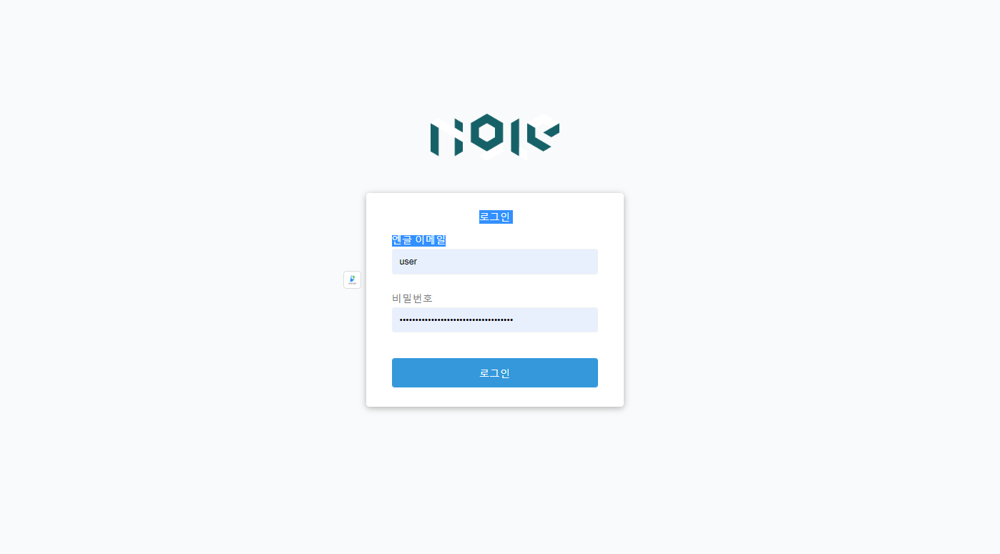

# 빌림이 프로젝트(개인 클론코딩)

회사 내부에서 진행하는 포로젝트의 일부를 어떻게 할지 감을 익힐겸 클론코딩하여

만들어보았다. 

-개인프로젝트

frontend-html,css,javscript(vanilla)

backend-springboot,spring mvc,mybatis,oracle sql

*추후 계속 추가 및 보완예정(ex: spring security를 통한 비밀번호 해쉬과정)
